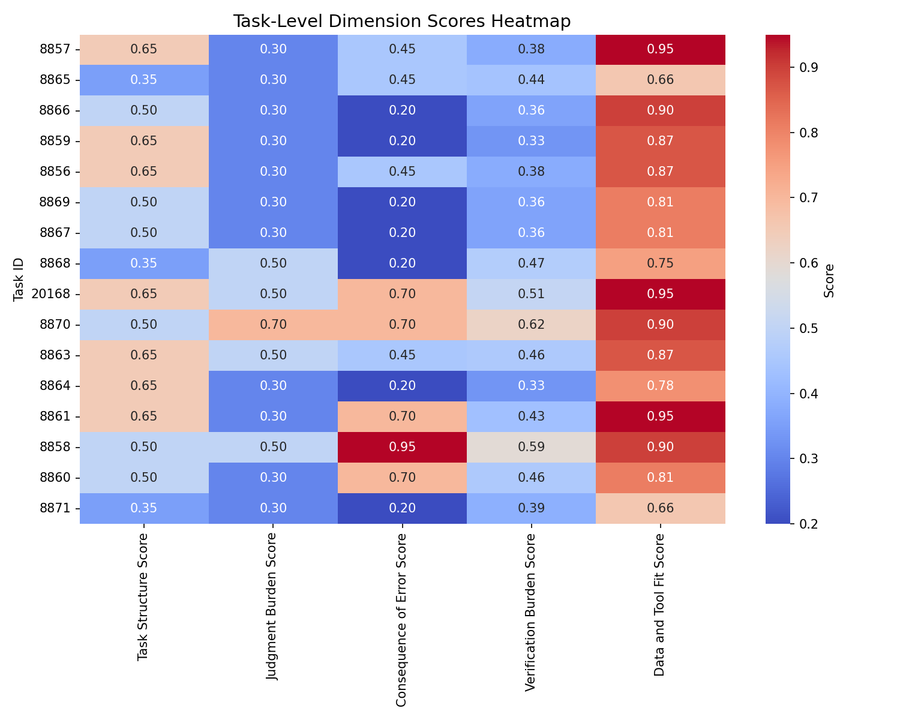
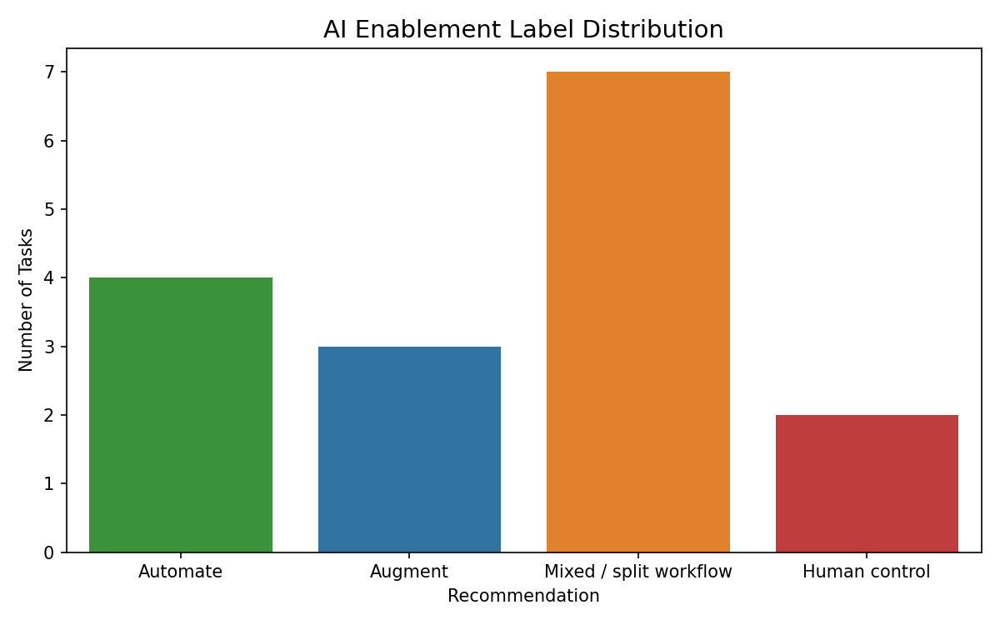

# Using the Task-Level Report

The task-level report is much more than a reference document.

It becomes the starting point for discussion, guided discovery, and workflow design throughout the workshop.

Rather than demonstrating AI tools first, participants investigate their own work through structured task analysis before deciding where AI may provide meaningful value.

---

# The Learning Process

Each participant works through a structured sequence of activities.

```text
Review the report

↓

Interpret the task analysis

↓

Identify AI opportunities

↓

Discuss recommendations

↓

Select an AI tool

↓

Design prompts

↓

Evaluate outputs

↓

Document an AI-supported workflow
```

This process reflects the workshop philosophy:

**Work Task → Opportunity → AI Tool → Prompt → Evaluation → Workflow → Adoption**

---

# Understanding the Report

Participants learn to interpret several visual summaries generated from the task analysis.

These visualisations help transform technical information into practical workplace discussions.

---

## Task-Level Heatmap



The heatmap allows participants to quickly identify which occupational tasks have stronger potential for automation, augmentation, or continued human control.

Rather than reading individual rows of data, learners can immediately recognise patterns across an entire occupational role.

Typical discussion questions include:

- Which tasks appear highly structured?
- Which tasks involve greater judgement?
- Where are verification requirements highest?
- Which activities may present greater organisational risk?

---

## Reasoning Profile


The radar chart summarises the average reasoning profile across the occupation using six analytical dimensions.

Participants compare these dimensions to their own experience and discuss how they influence AI suitability.

The chart encourages reflection rather than simply accepting automated recommendations.

---

## AI Recommendation Overview



The recommendation chart shows the proportion of tasks classified as:

- Automate
- Augment
- Mixed / Split Workflow
- Human Control

Participants quickly see that AI adoption is rarely an all-or-nothing decision.

Most occupations contain a combination of automation opportunities together with tasks requiring significant human judgement.

This supports one of the workshop's key learning messages:

**Responsible AI adoption means deciding where AI should assist—and where people should remain in control.**

---

# Facilitated Discussion

The report supports collaborative analysis rather than individual interpretation.

Typical facilitation questions include:

- Which recommendation surprised you?
- Which tasks should remain fully human?
- Which recommendations would require organisational approval?
- Which workflows could deliver immediate value?
- Which activities present greater risk?

Participants compare perspectives, challenge assumptions, and refine their thinking before beginning workflow design.

---

# From Analysis to Workflow

Once participants understand their task profile, they begin building practical AI-supported workflows.

The report provides evidence for these design decisions, helping learners connect AI to meaningful workplace improvements rather than isolated experiments.
